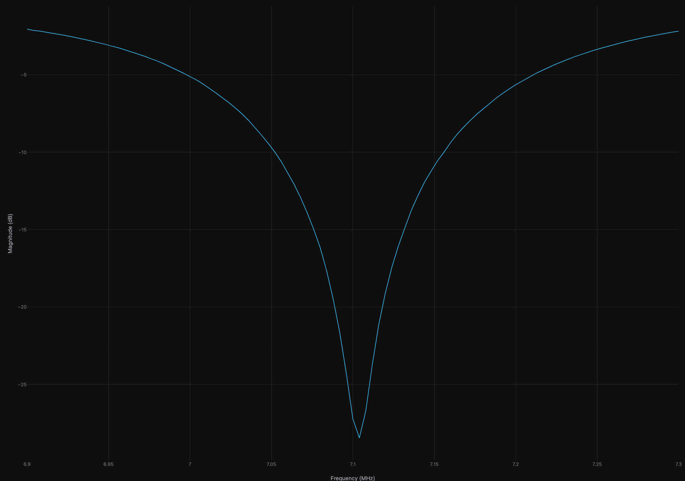

# vnaview

Browser-based viewer for [NanoVNA](https://nanovna.com/) `.s1p` and `.s2p` measurements. Runs 100% client-side — no data ever leaves your machine.



## Features

- Drag and drop `.s1p` or `.s2p` files — or click to browse
- Views: magnitude (dB), phase, VSWR, Smith chart
- Click the trace to place frequency markers; click a marker to remove it
- Load multiple files and switch between them, or enable **Compare** to overlay them on the same chart
- Zoom and pan with Plotly's built-in controls

## Development

Requires Docker.

```bash
make dev    # starts the dev server at http://localhost:5173
make test   # runs the test suite
make build  # builds the production image
```

## Deploy

```bash
make k8s-apply IMAGE=your-registry/vnaview:tag
```

Serves the app at `vna.home` via Traefik. Edit `k8s/ingress.yaml` to change the hostname.
